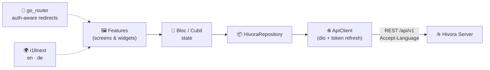

<!-- Logo -->
<p align="center">
  
</p>

<!-- Tagline -->
<p align="center">
  <b>Open-source, self-hosted project &amp; issue tracking — the Flutter app for the <a href="../Hivora-Server">Hivora Server</a>.</b><br>
  <sub>One codebase · Android · iOS · Web · macOS · no user or board limits, ever.</sub>
</p>

<!-- Badges -->
<p align="center">
  
  
  
  
</p>

<p align="center">
  <a href="#-how-it-works">How it works</a> ·
  <a href="#-features">Features</a> ·
  <a href="#-architecture">Architecture</a> ·
  <a href="#-development">Development</a> ·
  <a href="#-releases">Releases</a> ·
  <a href="#-license">License</a>
</p>

---

## 🍯 Why Hivora

Hivora is a fully responsive, localized project-management client that runs from
a **single Flutter codebase** on phone, tablet, web and desktop. Layout adapts
through golden-ratio-derived breakpoints (no fixed pixel widths), and the UI
ships in **English (UK)** and **Deutsch (Deutschland)** via i18next — with error
messages localized **by the server** through the `Accept-Language` header.

> 🎨 **Design language** — navy nav rail · warm-paper workspace · a signature
> honey-amber accent (`#D9A032`) that reads identically in light and dark mode.

---

## 🚀 How it works

| | Step | What happens |
|:-:|---|---|
| 🔌 | **Connect** | On first start the app asks for your server URL and only continues once the server answers. |
| 🛡️ | **Version gate** | The app compares its version with the server's `minAppVersion` on every start and forces an update when required. |
| 🧙 | **Setup wizard** | A fresh server is configured directly in the app (organization + first admin) — unless bootstrapped via `HIVORA_SETUP_*`. |
| 🧭 | **Onboarding** | A one-time illustrated tour of the key features. |
| 🔑 | **Sign in** | Local credentials, or SSO (OpenID Connect, OAuth 2.0, SAML, LDAP — e.g. Synology SSO). SSO returns via the `hivora://auth-callback` deep link. |

---

## ✨ Features

<table>
  <tr>
    <td>📊 <b>Dashboard</b><br><sub>today's tasks, completion, ranking, tracker</sub></td>
    <td>📁 <b>Projects</b><br><sub>per-project workflows &amp; keys</sub></td>
    <td>🐛 <b>Issues</b><br><sub>comments, attachments, time logging</sub></td>
  </tr>
  <tr>
    <td>📋 <b>Agile board</b><br><sub>drag &amp; drop, WIP limits</sub></td>
    <td>📈 <b>Gantt</b><br><sub>timeline &amp; dependencies</sub></td>
    <td>⏱️ <b>Timesheets</b><br><sub>weekly time tracking</sub></td>
  </tr>
  <tr>
    <td>📑 <b>Reports</b><br><sub>distributions &amp; trends</sub></td>
    <td>📚 <b>Knowledge base</b><br><sub>hierarchical Markdown</sub></td>
    <td>🔔 <b>Notifications</b><br><sub>in-app &amp; e-mail</sub></td>
  </tr>
  <tr>
    <td>⚙️ <b>Settings</b><br><sub>language, privacy, versions</sub></td>
    <td>🛠️ <b>Admin</b><br><sub>SSO, mail-to-ticket, users</sub></td>
    <td>🔍 <b>Command palette</b><br><sub>⌘K global search</sub></td>
  </tr>
</table>

---

## 🧱 Architecture



<details>
  <summary><b>📦 Tech stack &amp; project layout</b></summary>

<br>

| Concern | Library |
|---|---|
| **State** | bloc · flutter_bloc · hydrated_bloc · bloc_concurrency · replay_bloc |
| **Routing** | go_router (auth-aware redirects) |
| **i18n** | i18next (`assets/i18n/{en,de}/common.json`) |
| **Networking** | dio (automatic token refresh, `Accept-Language`) |
| **Modals** | wolt_modal_sheet (sheet on phones, dialog on desktop) |
| **Charts** | fl_chart |

```text
lib/
  core/        theme, responsive system, i18n, api, models, blocs, router, widgets
  features/    connect, setup, onboarding, auth, shell, dashboard, projects,
               issues, board, gantt, timesheet, reports, knowledge,
               notifications, settings, admin
```
</details>

---

## 🛠️ Development

```bash
flutter pub get
flutter run
```

<details>
  <summary><b>🔧 Useful commands</b></summary>

<br>

```bash
flutter analyze && flutter test          # quality gate (CI runs the same)
dart run flutter_native_splash:create    # regenerate splash screens
dart run flutter_launcher_icons          # regenerate app icons
```
</details>

Start the backend as described in
[Hivora-Server/README.md](../Hivora-Server/README.md), then point the app at
`http://localhost:8080` (Android emulator: `http://10.0.2.2:8080`).

---

## 📦 Releases

Pushing a `v*` tag triggers [release.yml](.github/workflows/release.yml):

- 🤖 **Android** → Play Store *internal* track (`android/fastlane`, lane `internal`)
- 🍏 **iOS** → TestFlight (`ios/fastlane`, lane `beta`, signing via *match*)

<details>
  <summary><b>🔐 Required repository secrets</b></summary>

<br>

| Secret | Used for |
| --- | --- |
| `PLAY_JSON_KEY` | Play Console service account JSON |
| `ANDROID_KEYSTORE_BASE64`, `ANDROID_KEYSTORE_PASSWORD`, `ANDROID_KEY_ALIAS` | Upload keystore |
| `APP_STORE_CONNECT_API_KEY_ID`, `APP_STORE_CONNECT_ISSUER_ID`, `APP_STORE_CONNECT_API_KEY_CONTENT` | App Store Connect API key |
| `MATCH_GIT_URL`, `MATCH_PASSWORD`, `MATCH_GIT_BASIC_AUTHORIZATION` | fastlane match certificate repo |

</details>

> **Store compliance** — bundle id `hivora.asta.hn`; the privacy-policy URL shown
> in the app comes from the server (`HIVORA_PRIVACY_POLICY_URL`), required for App
> Store / Play Store review and GDPR (DSGVO). The UI is accessibility-minded
> (BFSG): scalable text, semantic widgets, sufficient contrast.

---

## 📄 License

**GPL-3.0** — see [LICENSE](LICENSE).

<p align="center"><sub>Made with 🍯 by AStA der Hochschule Niederrhein</sub></p>
